= Отчет по лабораторной работе No.1
:listing-caption: Листинг
:source-highlighter: coderay

Студенты: Перхуров В.А., Беляев А.Е.

Группа: ИВМ-22

== 1. Постановка задачи

В процессе выполнения лабораторной работы необходимо выполнить следующие задачи:

. Изучение базовых команд консоли:
.. Перемещение по каталогам файловой системы.
.. Создание/удаление каталогов и файлов.
.. Выделение прав для файлов (чтение, изменение,…).
.. Просмотр содержимого каталога.
.. Монтирование дисков.
.. Изучение man.
. Работа с пользователями системы:
.. Создание пользователя с помощью консоли.
.. Выделение прав для пользователя.
.. Удаление пользователя (прежде чем удалять показать, что создали и зашли под этим пользователем).
. Установка и удаление программ.
.. Изучить способы установки программ на linux.
.. Что такое snap, apt, apt-get.
.. Установить и удалить с помощью консоли ПО (например Sublime, если есть уже, то можно любое другое).
. Shell, curl, SSH.
.. Изучить shell - скрипты.
.. Изучить curl и попробовать.
.. Написать скрипт (продемонстрировать его работу).
.. Изучить ssh.

== 2. Ход выполнения задачи

=== 2.1 Изучение базовых команд консоли

==== 2.1.1 Перемещение по каталогам файловой системы:

Перемещение по каталогам файловой системы выполняется с помощью команды "cd":

.Команда перемещения в нужный каталог файловой системы
----
cd <путь до папки>
----

.Демонстрация работы команды перемещения в нужный каталог файловой системы (полный путь)
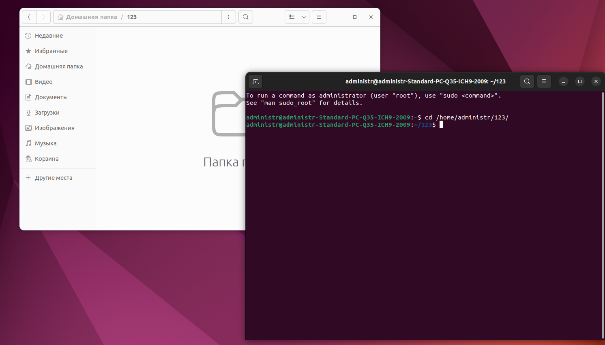

.Команда перемещения на уровень выше
----
cd ../
----

.Демонстрация работы команды перемещения в нужный каталог файловой системы (относительный путь на уровень выше)
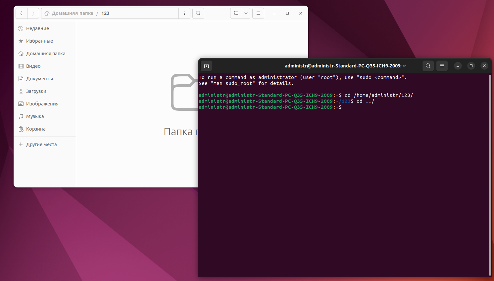

.Команда перемещения во вложенную папку
----
cd ./<имя папки>
----

.Демонстрация работы команды перемещения в нужный каталог файловой системы (относительный путь на уровень ниже)
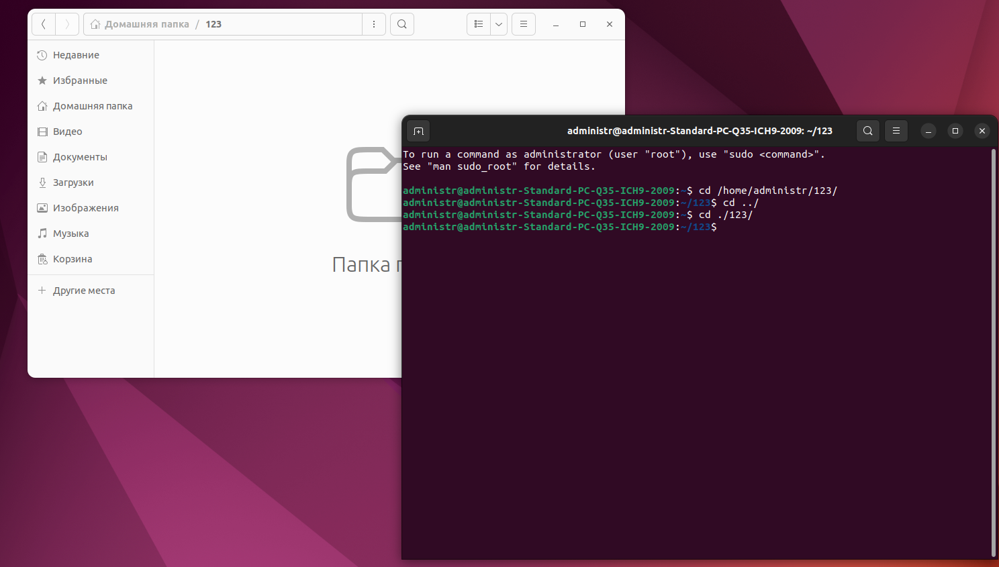

==== 2.1.2 Создание/удаление каталогов и файлов

Создание папки выполняется с помощью следующей команды:

.Команда создания папки
----
mkdir <имя папки>
----

.Демонстрация работы команды создания папки
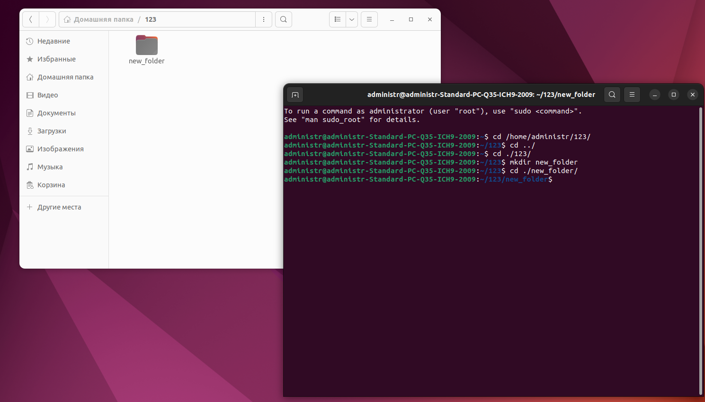

Удаление папки выполняется с помощью следующей команды:

.Команда удаления папки
----
rmdir <имя папки>
----

.Демонстрация работы команды удаления папки
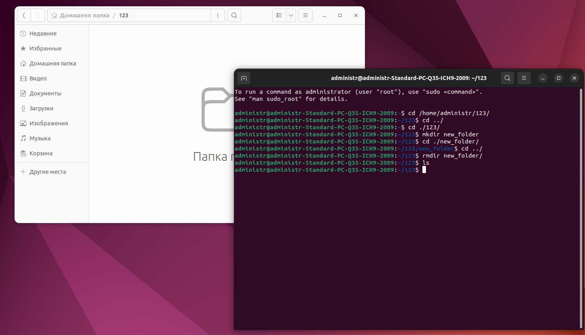

Создание файла выполняется с помощью следующей команды:

.Команда создания файла
----
> <имя нового файла>
----

.Демонстрация работы команды создания файла
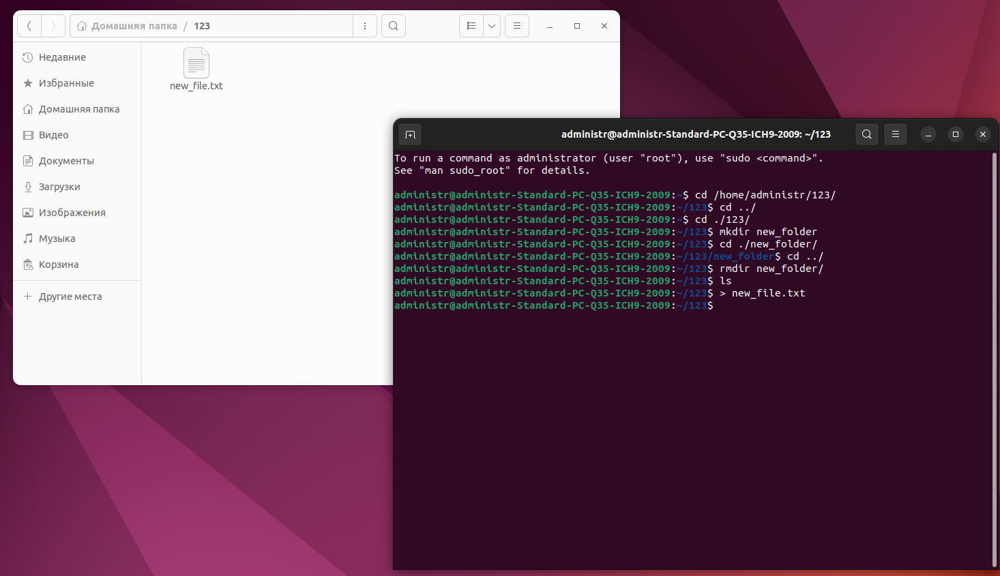

Удаление файла выполняется с помощью следующей команды:

.Команда удаления файла
----
rm <путь до файла>
----

.Демонстрация работы команды удаления файла
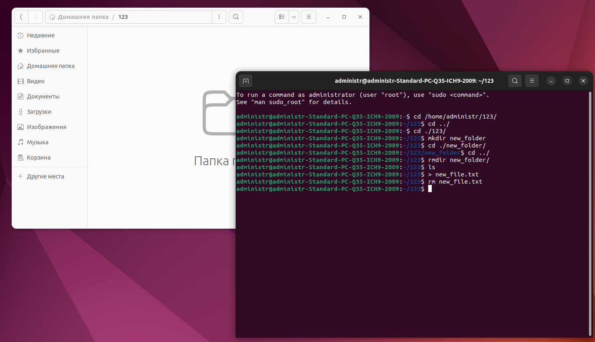

==== 2.1.3 Выделение прав для файлов (чтение, изменение,…)

Выделение прав для файла выполняется с помощью следующей команды:

.Команда выделения прав для файла
----
chmod <категория> <действие> <флаг> <путь до файла или папки>
----

Ключ "категория" указывает для какой группы пользователей нужно применять права и может принять любую комбинацию из следующих значений:

* "u" - владелец файла;
* "g" - группа файла;
* "o" - другие пользователи;
* "a" - все пользователи.

Ключ "действие" позволяет добавить или убрать право:

* "+" - добавить нужные права;
* "-" - убрать нужные права;
* "=" - устанавливаем нужные права.

Ключ "флаг" указывает какие именно права нужно установить/снять:

* "r" - право на чтение;
* "w" - право на запись;
* "x" - право на выполнение.

.Демонстрация работы команды просмотра содержимого текущей папки
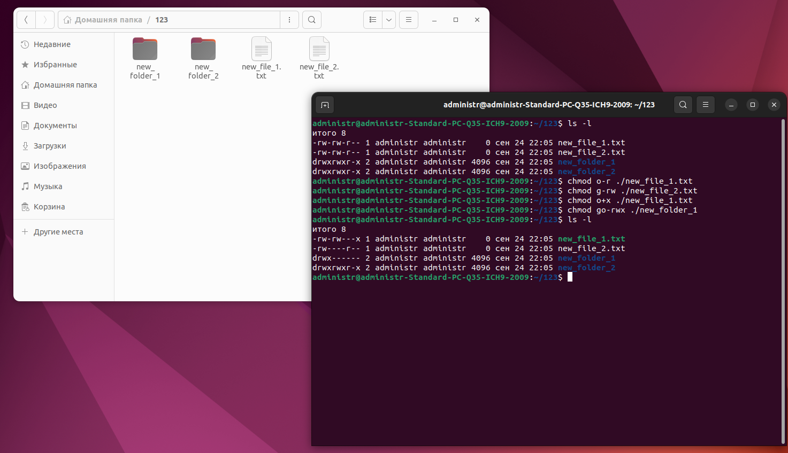

==== 2.1.4 Просмотр содержимого каталога

Просмотр содержимого папки выполняется с помощью следующей команды:

.Команда просмотра содержимого текущей папки
----
ls ./
----

.Демонстрация работы команды просмотра содержимого текущей папки
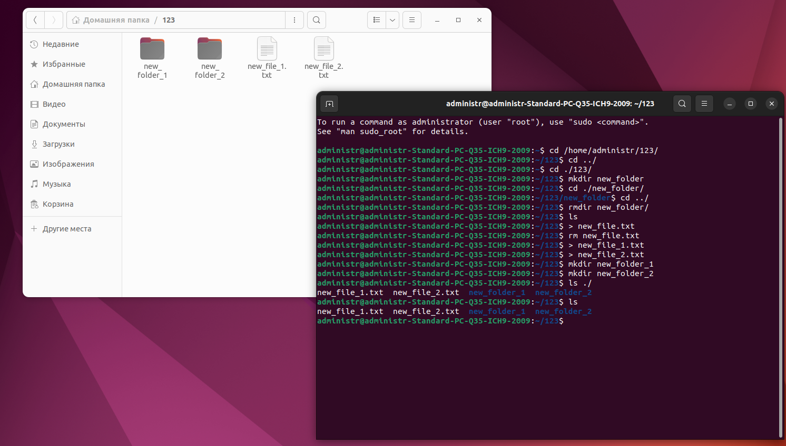

==== 2.1.5 Монтирование дисков

Монтирование дисков выполняется в два этапа:

. Создание диска.
. Монтирование диска.

Поиск и создание диска для монтирования выполняется посредством команды "fdisk":

* С помощью команды "sudo fdisk -l" находим нужный диск.
* С помощью команды "sudo fdisk /dev/<имя диска>" создаём диск.
* С помощью команды "sudo mkfs.ext4 /dev/<имя диска>" форматируем диск.

Подробный ход создания диска представлен на скрине ниже:

.Демонстрация создания диска
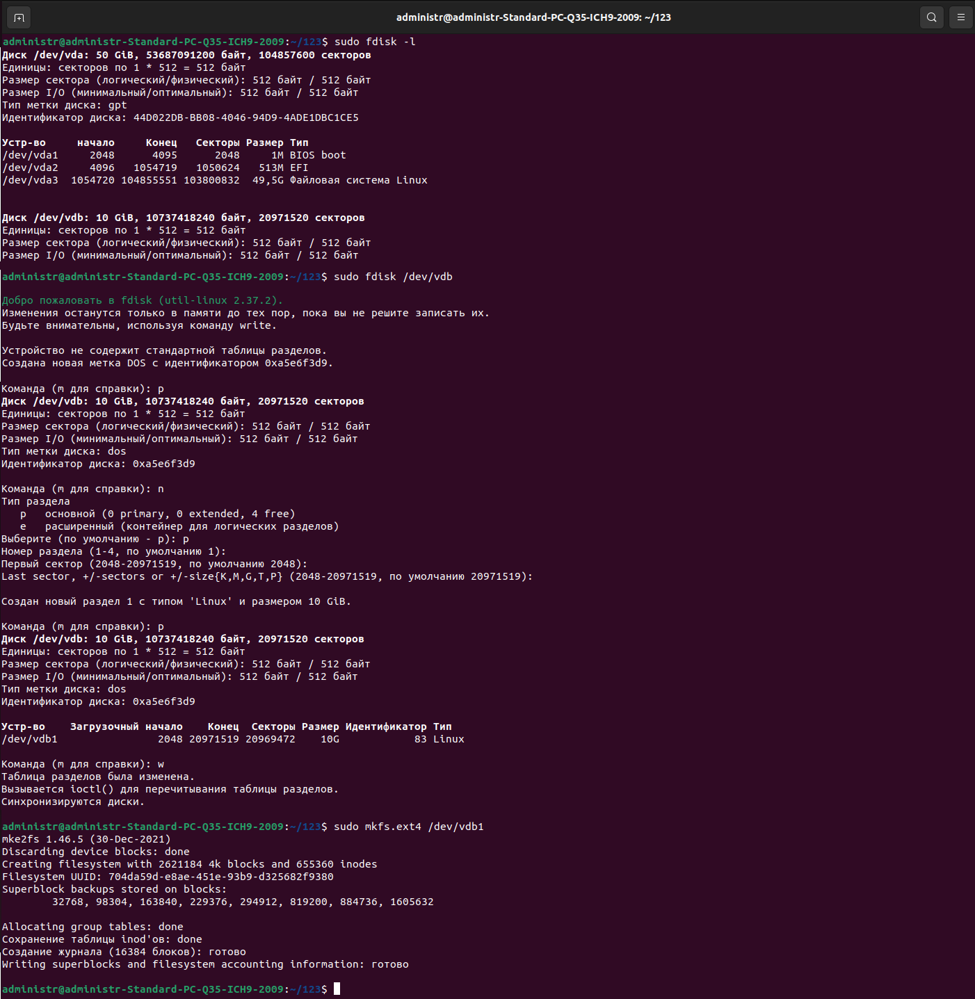

После создания диска нужно его примонтировать. Для этого используется команда "mount".

.Команда монтирования устройства в указанную папки
----
mount <файл устройства> <папка назначения>
----

.Демонстрация работы команды монтирования устройства в указанную папки
image::images/command_mount.png[]

==== 2.1.6 Изучение man

Команда "man" позволяет получить доступ к общей базе справки по команде, функции или программе. Обычно для просмотра справки программе надо передать название команды или другого объекта в системе.

.Команда просмотра справки по команде, функции или программе
----
man <название команды>
----

.Демонстрация работы команды просмотра справки
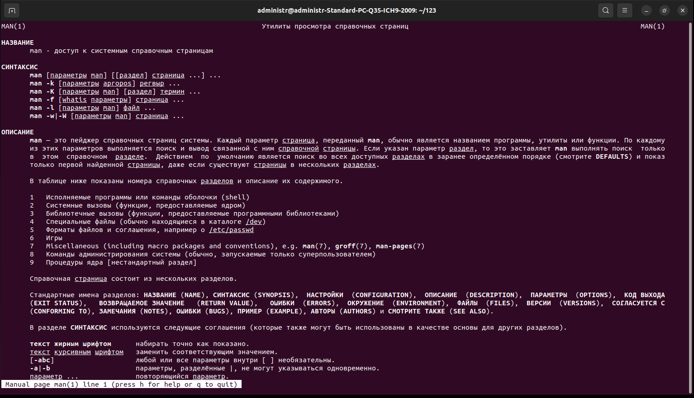

=== 2.2 Работа с пользователями системы

==== 2.2.1 Создание пользователя с помощью консоли

Создание нового пользователя выполняется с помощью следующей команды:

.Команда создания пользователя
----
useradd <опции> <имя пользователя>
----

Основные опции, с помощью которых выполняется настройка пользователя:

* "-b" - базовый каталог для размещения домашнего каталога пользователя, по умолчанию /home;
* "-c" - комментарий к учётной записи;
* "-d" - домашний каталог, в котором будут размещаться файлы пользователя;
* "-e" - дата, когда учётная запись пользователя будет заблокирована, в формате ГГГГ-ММ-ДД;
* "-f" - заблокировать учётную запись сразу после создания;
* "-g" - основная группа пользователя;
* "-G" - список дополнительных групп;
* "-k" - каталог с шаблонами конфигурационных файлов;
* "-l" - не сохранять информацию о входах пользователя в lastlog и faillog;
* "-m" - создавать домашний каталог пользователя, если он не существует;
* "-M" - не создавать домашнюю папку;
* "-N" - не создавать группу с именем пользователя;
* "-o" - разрешить создание пользователя linux с неуникальным идентификатором UID;
* "-p" - задать пароль пользователя;
* "-r" - создать системного пользователя, не имеет оболочки входа, без домашней директории и с идентификатором до SYS_UID_MAX;
* "-s" - командная оболочка для пользователя;
* "-u" - идентификатор для пользователя;
* "-D" - отобразить параметры, которые используются по умолчанию для создания пользователя. Если вместе с этой опцией задать ещё какой-либо параметр, то его значение по умолчанию будет переопределено.

Создание пользователя выполняется в 2 этапа:

. Создание пользователя c его папкой.
. Задание пароля командой "sudo passwd <имя пользователя>".

.Демонстрация системы до создания пользователя
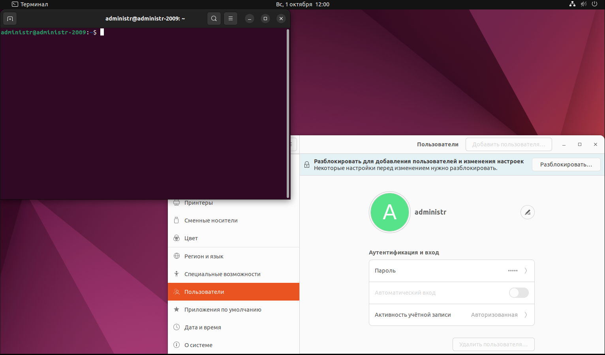

.Демонстрация системы после создания пользователя
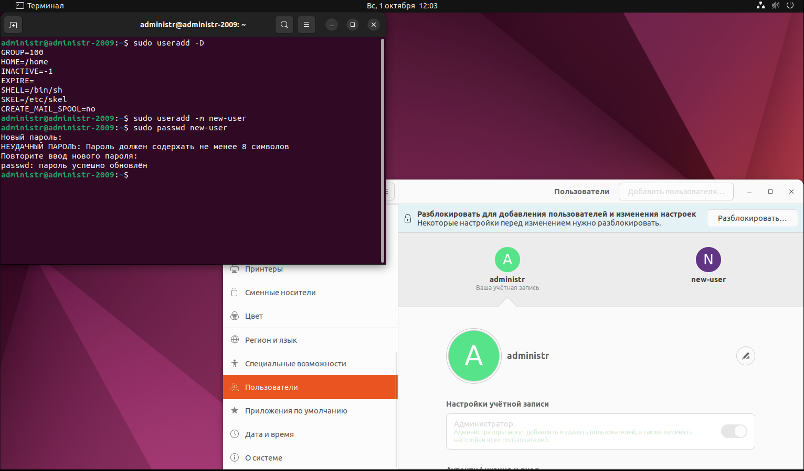

.Демонстрация системы после входа под новым пользователем
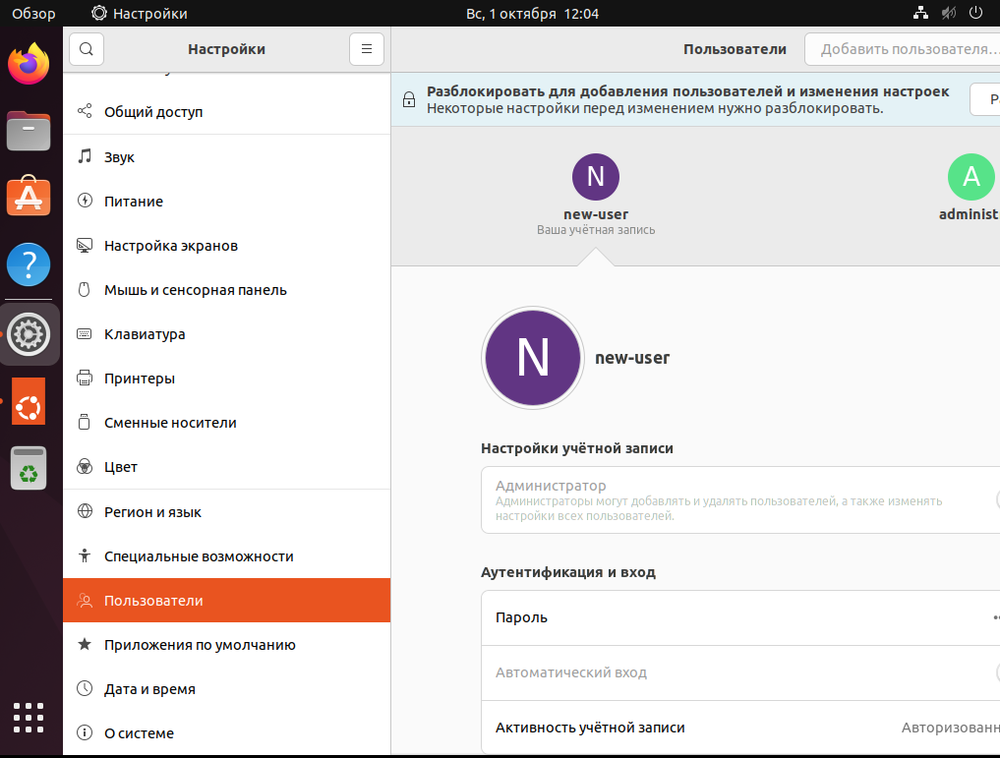

==== 2.2.2 Выделение прав для пользователя

Выделение прав для пользователя выполняется с помощью следующей команды:

.Команда выделения прав для пользователя
----
chown <новый пользователь>:<новая группа> <путь до файла или папки>
----

.Демонстрация работы команды выделения прав для пользователя
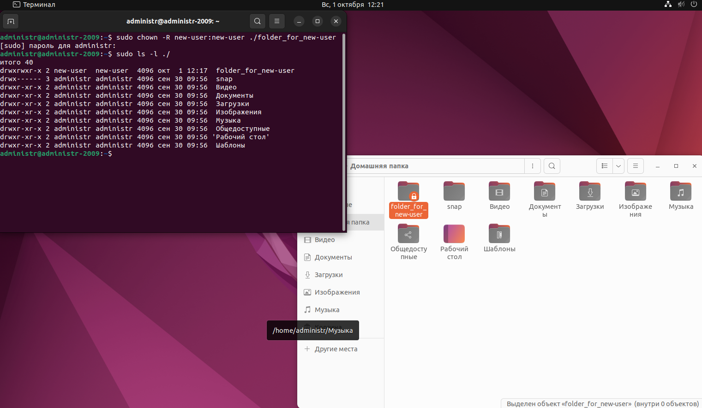

==== 2.2.3 Удаление пользователя

Удаление пользователя выполняется с помощью следующей команды:

.Команда удаления пользователя
----
userdel <опции> <имя пользователя>
----

.Демонстрация работы команды удаления пользователя
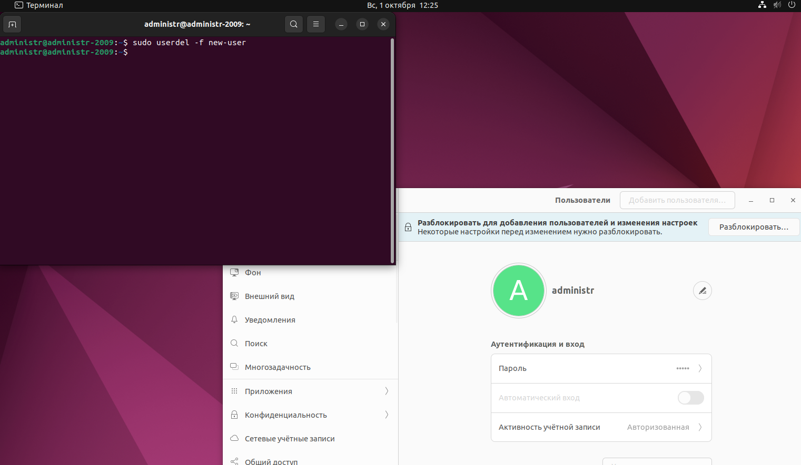

=== 2.3 Установка и удаление программ

==== 2.3.1 Изучить способы установки программ на linux

Установить программу на linux можно следующими способами:

. Скачать готовый архив с программой из стороннего источника.
. Скачать готовый архив с программой через пакетный менеджер.
. Скачать и потом собрать исходники из стороннего источника.
. Скачать и потом собрать исходники через пакетный менеджер.

==== 2.3.2 Что такое snap, apt, apt-get

snap, apt, apt-get - пакетные менеджеры с помощью которых можно скачивать, устанавливать, обновлять и удалять программы и необходимые библиотеки в автоматическом режиме.

==== 2.3.3 Установить и удалить с помощью консоли ПО (например Sublime, если есть уже, то можно любое другое)

Установка приложения через консоль (пакетный менеджер) выполняется с помощью следующей команды:

.Команда установки приложения
----
sudo apt install <название приложения>
----

.Демонстрация вызова команды установки приложения
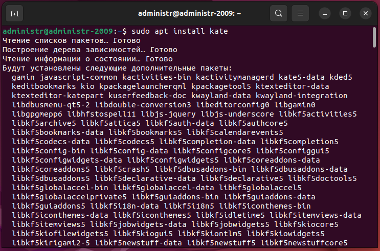

.Демонстрация выполнения команды установки приложения
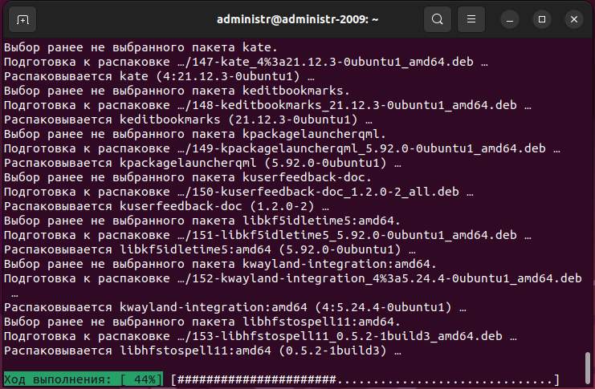

.Демонстрация конца выполнения команды установки приложения и запуск установленного приложения
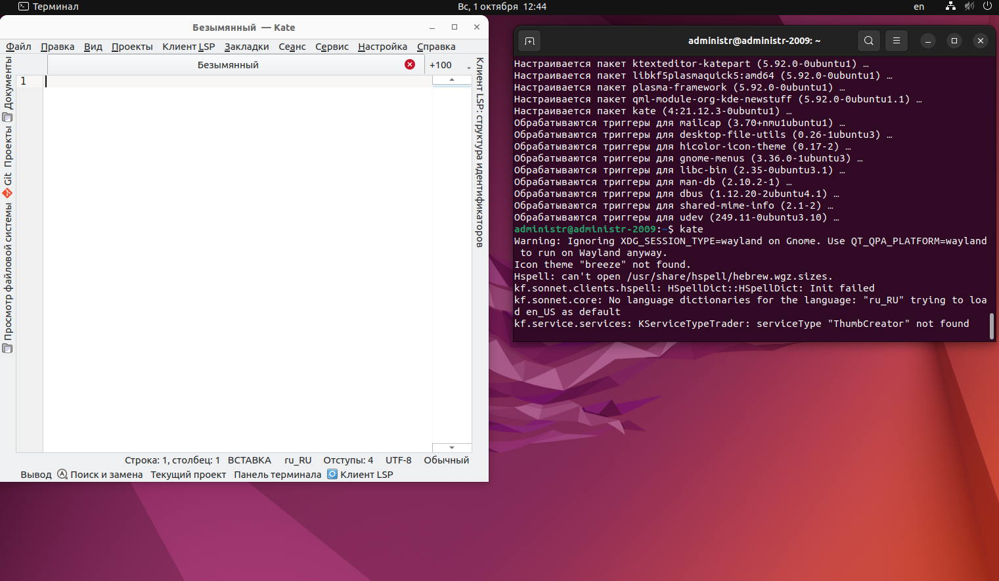

Обновление приложения через консоль (пакетный менеджер) выполняется с помощью следующей команды:

.Команда установки приложения
----
sudo apt upgrade <название приложения>
----

.Демонстрация вызова команды обновления приложения
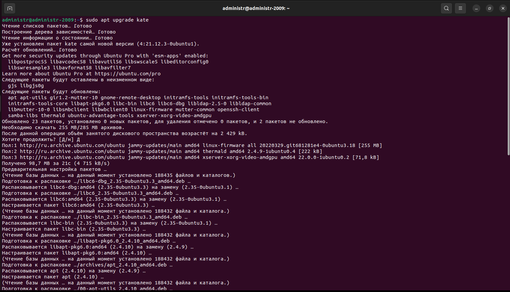

.Демонстрация выполнения команды обновления приложения
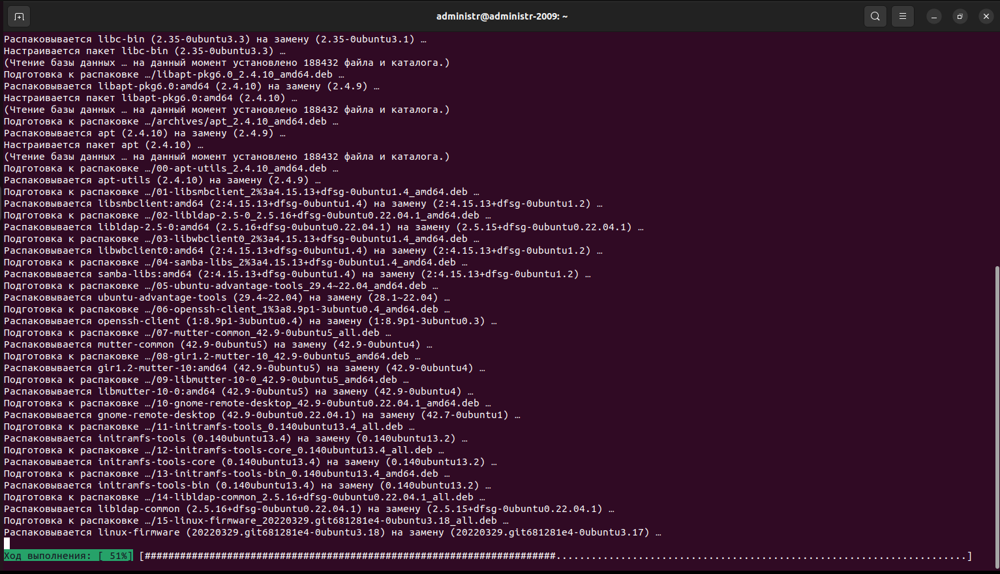

Удаление приложения через консоль (пакетный менеджер) выполняется с помощью следующей команды:

.Команда установки приложения
----
sudo apt remove <название приложения>
----

.Демонстрация вызова команды удаления приложения
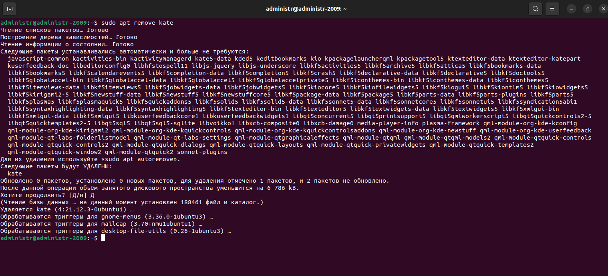

=== 2.4 Shell, curl, SSH

==== 2.4.1 Изучить shell - скрипты

Shell или командная оболочка - это программа, которая организовывает среду для выполнения других программ и команд. Командная оболочка имеет свои встроенные команды, арифметические операторы и другие синтаксические выражения, но основная её задача упрощать запуск других программ.

.Команда запуска скрипта
----
sh <название файла со скриптом>
----

.Демонстрация запуска скрипта
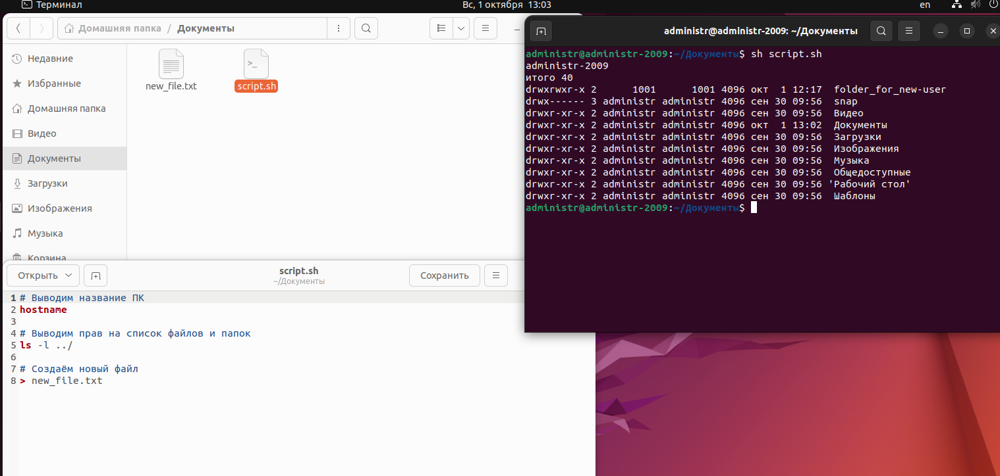

==== 2.4.2 Изучить curl и попробовать

Curl (client URL) — это инструмент командной строки на основе библиотеки libcurl для передачи данных с сервера и на сервер при помощи различных протоколов, в том числе HTTP, HTTPS, FTP, FTPS, IMAP, IMAPS, POP3, POP3S, SMTP и SMTPS.

.Команда запуска curl
----
curl <опции> <ссылка>
----

Основные опции Curl:

* "-#" - отображать простой прогресс-бар во время загрузки;
* "-0" - использовать протокол http 1.0;
* "-1" - использовать протокол шифрования tlsv1;
* "-2" - использовать sslv2;
* "-3" - использовать sslv3;
* "-4" - использовать ipv4;
* "-6" - использовать ipv6;
* "-A" - указать свой USER_AGENT;
* "-b" - сохранить Cookie в файл;
* "-c" - отправить Cookie на сервер из файла;
* "-C" - продолжить загрузку файла с места разрыва или указанного смещения;
* "-m" - максимальное время ожидания ответа от сервера;
* "-d" - отправить данные методом POST;
* "-D" - сохранить заголовки, возвращённые сервером в файл;
* "-e" - задать поле Referer-uri, указывает с какого сайта пришел пользователь;
* "-E" - использовать внешний сертификат SSL;
* "-f" - не выводить сообщения об ошибках;
* "-F" - отправить данные в виде формы;
* "-G" - если эта опция включена, то все данные, указанные в опции -d будут передаваться методом GET;
* "-H" - передать заголовки на сервер;
* "-I" - получать только HTTP заголовок, а все содержимое страницы игнорировать;
* "-j" - прочитать и отправить cookie из файла;
* "-J" - удалить заголовок из запроса;
* "-L" - принимать и обрабатывать перенаправления;
* "-s" - максимальное количество перенаправлений с помощью Location;
* "-o" - выводить контент страницы в файл;
* "-O" - сохранять контент в файл с именем страницы или файла на сервере;
* "-p" - использовать прокси;
* "--proto" - указать протокол, который нужно использовать;
* "-R" -  сохранять время последнего изменения удалённого файла;
* "-s" - выводить минимум информации об ошибках;
* "-S" - выводить сообщения об ошибках;
* "-T" - загрузить файл на сервер;
* "-v" - максимально подробный вывод;
* "-y" - минимальная скорость загрузки;
* "-Y" - максимальная скорость загрузки;
* "-z" - скачать файл, только если он был модифицирован позже указанного времени;
* "-V" - вывести версию.

.Демонстрация запуска Curl
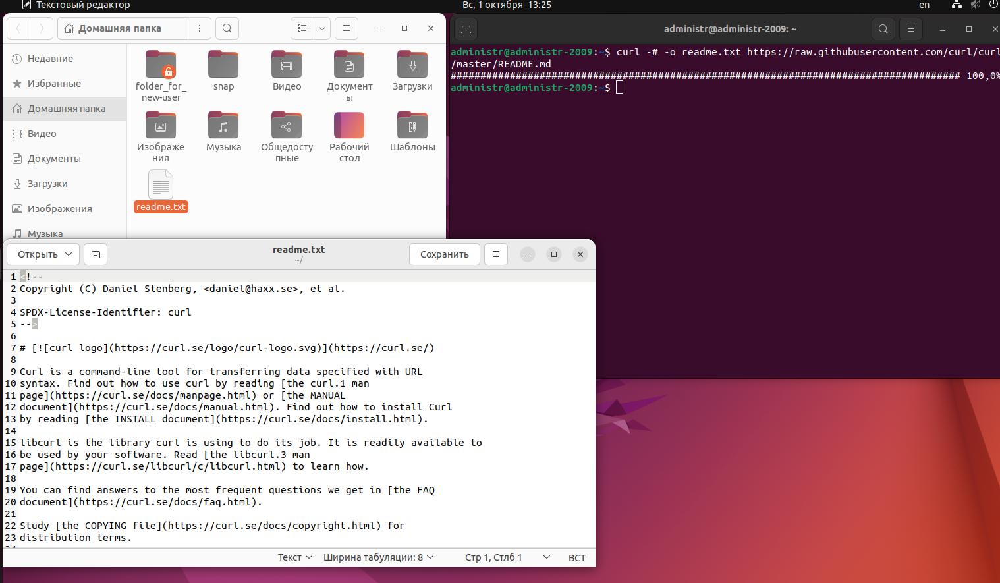

==== 2.4.3 Изучить ssh

SSH (Secure Shell) — это сетевой протокол прикладного уровня, позволяющий производить удалённое управление операционной системой и туннелирование TCP-соединений.

Для подключения по ssh нужно установить ssh-сервер (клиент присутствует по умолчанию в любом linux). Для этого нужно ввести следующие команды:

.Команда установки и запуска SSH-сервера
----
apt install openssh-server -y
systemctl enable ssh
systemctl start ssh
----

.Демонстрация установки и запуска SSH-сервера
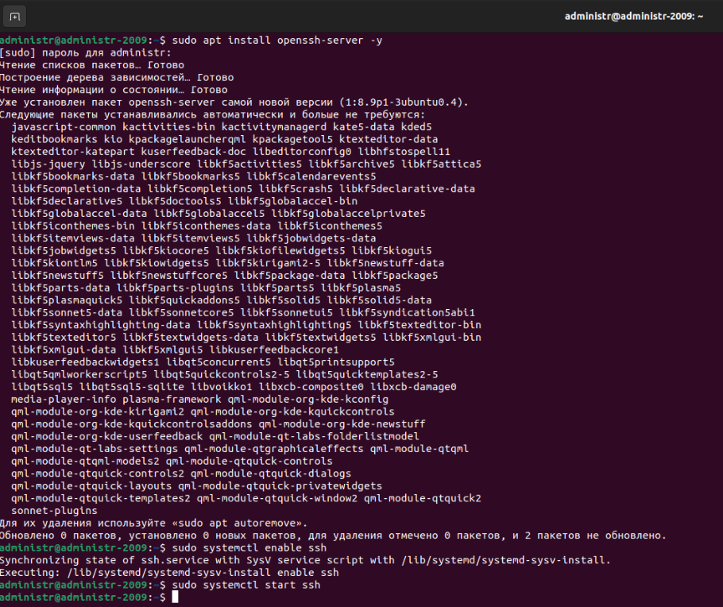

Для подключения к SSH-серверу со стороны клиента нужно выполнить следующую команду:

.Команда подключения к SSH-серверу
----
ssh <имя пользователя>@<ip сервера>
----

Для отключения от SSH-сервера нужно выполнить следующую команду:

.Команда отключения от SSH-сервера
----
logout
----

На скриншоте ниже продемонстрирован подключение к компьютеру по SSH, создание и редактирование файла и отключение от SSH-сервера:

.Демонстрация подключения к SSH-серверу
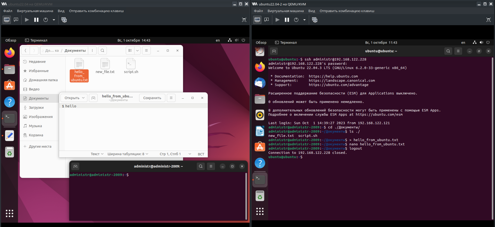

== 3. Результаты выполнения

В результате выполнения задания было выполнено:

* Изучены базовые команды терминала;
* Изучены основы работы с пользователями системы;
* Изучена установки и удаления программ с помощью пакетного менеджера apt;
* Изучены технологии Shell, curl, SSH.

== 4. Вывод

В результате выполнения лабораторной работы получены следующие навыки по работе с ОС Linux:

* Изучены и применены на практике базовые команды терминала для навигации и работе в файловой системе Linux;
* Изучены и применены на практике команды для управления пользователями системы;
* Изучены и применены на практике команды (установки, обновления и удаления) пакетного менеджера apt;
* Изучены и применены на практике технологии Shell, curl, SSH.
