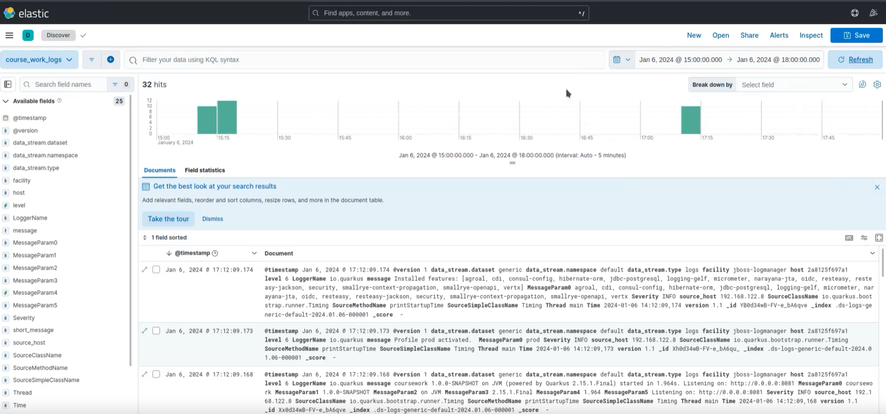

= Отчет по лабораторной работе No.4
:listing-caption: Листинг
:source-highlighter: coderay

Студенты: Перхуров В.А., Беляев А.Е.

Группа: ИВМ-22

== 1. Постановка задачи

В процессе выполнения лабораторной работы необходимо выполнить следующие задачи:

. Ознакомиться с ELK-стеком
. Развернуть компоненты ELK-стека с помощью docker-compose
. Организовать вывод логов backend'а в ELK

== 2. Ход выполнения задачи

=== 2.1 Ознакомление с ELK-стеком

Стек ELK состоит из 3-х программных решений:

* Elasticsearch (хранение и поиск данных);
* Logstash (конвейер для обработки, фильтрации и нормализации логов);
* Kibana (интерфейс для удобного поиска и администрирования).

Так как серверная часть создана с применением фреймворка Quarcus, то целесообразно использовать решение, интегрированное в него для отправки логов.

Данный стек работает следующим образом: агент, работающий на серверной части посылает логи приложения в Logstash, который анализирует их и сохраняет в индекс (реестр) Elasticsearch, который является не реляционной базой данных. Kibana считывает данные из Elasticsearch и используется для их визуализации.

Для работы агента на серверной части необходимо добавить его в зависимости проекта, а также добавить в файл настроек параметры подключения–IP-адрес сервера с Logstash.

.Зависимость quarkus-logging-gelf
[source,xml]
----
<dependency>
    <groupId>io.quarkus</groupId>
    <artifactId>quarkus-logging-gelf</artifactId>
</dependency>
----

.Параметры подключения
[source,xml]
----
quarkus.log.handler.gelf.enabled=true
quarkus.log.handler.gelf.host=192.168.122.4
quarkus.log.handler.gelf.port=12201
----

Помимо этого необходимо добавить файл конфигурации gelf.conf, который сконфигурирует Logstash на отправку данных на IP-адрес Elasticsearch.

.Файл настройки пересылки (pipelines)
[source,xml]
----
input {
  gelf {
    port => 12201
  }
}
output {
  stdout {}
  elasticsearch {
    hosts => ["http://host.docker.internal:9200"]
    user => "elastic"
    password => "J9YTkB2BkNym5bt8Rj8w"
    ssl_certificate_verification => false
  }
}
----

=== 2.2 Развёртывание компонентов ELK-стека с помощью docker-compose
 
Для развёртывания компонентов ELK-стека нужно сформировать файл docker-compose.yml.

.Листинг настроечного файла docker-compose.yml
[source,xml]
----
version: '3.7'

name: my_project

services:
    elasticsearch:
        image: elasticsearch:8.11.3
        ports:
            - target: 9200
              published: 9200
              protocol: tcp
              mode: host
        environment:
            ES_JAVA_OPTS: "-Xms512m -Xmx512m"
            discovery.type: "single-node"
            xpack.security.enabled: false
            cluster.routing.allocation.disk.threshold_enabled: false
        ulimits:
            memlock:
                soft: -1
                hard: -1
        volumes:
            - ./elasticsearch:/usr/share/elasticsearch/data
        deploy:
            resources:
                limits:
                    memory: 1GB
        extra_hosts:
            - "host.docker.internal:host-gateway"

    kibana:
        image: kibana:8.11.3
        ports:
            - target: 5601
              published: 5601
              protocol: tcp
              mode: host
        volumes:
            - ./kibana:/usr/share/kibana/data
        environment:
            SERVER_NAME: localhost:5601
            XPACK_SECURITY_ENABLED: "false"
        extra_hosts:
            - "host.docker.internal:host-gateway"
        depends_on:
            - elasticsearch

    logstash:
        image: logstash:8.11.3
        volumes:
            - source: './pipelines'
              target: /usr/share/logstash/pipeline
              type: bind
        ports:
            - target: 12201
              published: 12201
              protocol: udp
              mode: host
            - target: 5000
              published: 5000
              protocol: tcp
              mode: host
            - target: 9600
              published: 9600
              protocol: tcp
              mode: host
        environment:
            XPACK_MONITORING_ENABLED: "false"
        extra_hosts:
            - "host.docker.internal:host-gateway"
        depends_on:
            - kibana
----

Теперь можно запустить ELK в докере с помощью следующей команды:

----
sudo docker-compose up
----

=== 2.3 Организация вывода логов backend'а в ELK

После запуска контейнеров можно управлять данным с помощью Kibana, при этом, при первом входе может потребоваться сгенерировать токены и пароли для входа, для этого необходимо будет выполнить в контейнерах действия, запрашиваемые системой.

.Вывод логов backend'а в ELK

== 3. Результаты выполнения

В результате выполнения задания было выполнено:

. Ознакомление с ELK-стеком
. Развёртывание компонентов ELK-стека с помощью docker-compose
. Организация вывода логов backend'а в ELK

== 4. Вывод

В результате выполнения лабораторной работы получены навыки по работе с ELK-стекем.
