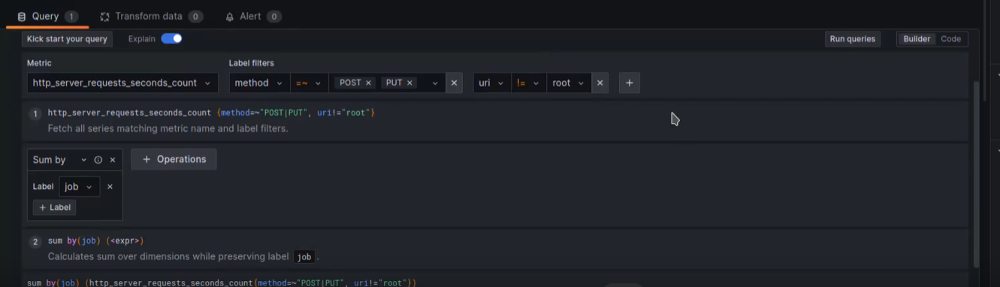
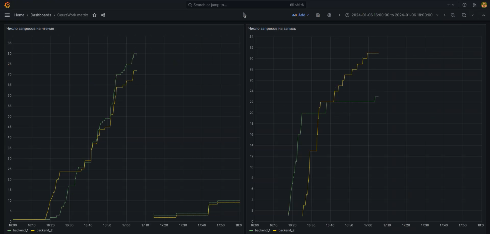

= Отчет по лабораторной работе No.5
:listing-caption: Листинг
:source-highlighter: coderay

Студенты: Перхуров В.А., Беляев А.Е.

Группа: ИВМ-22

== 1. Постановка задачи

В процессе выполнения лабораторной работы необходимо выполнить следующие задачи:

. Ознакомиться с инструментами prometheus и grafana
. Развернуть prometheus и grafana с помощью docker-compose
. Организовать мониторинг микросервисов приложения с помощью prometheus и grafana

== 2. Ход выполнения задачи

=== 2.1 Ознакомление с инструментами prometheus и grafana

Так как серверная часть создана с применением фреймворка Quarcus, то целесообразно использовать решение, интегрированное в него для создания метрик.

Расширение фреймворка генерирует метрики, как стандартные, так возможно и создание пользовательских метрик. Prometheus обеспечивает сбор метрик по указанному пути и их сохранение в базе данных, группируя по содержанию метрики. Grafana используется для получения метрик из Prometheus и их визуализации, в том числе с использованием досок.

Для работы Prometheus необходимо настроить файл его конфигурации, указав в нём пути, по которым необходимо собирать метрики.

.Файл конфигурации Prometheus
[source,hcl]
----
# my global config
global:
 scrape_interval:     15s # Set the scrape interval to every 15 seconds. Default is every 1 minute.
 evaluation_interval: 15s # Evaluate rules every 15 seconds. The default is every 1 minute.

# Load rules once and periodically evaluate them according to the global 'evaluation_interval'.
rule_files:

# A scrape configuration containing exactly one endpoint to scrape:
# Here it's Prometheus itself.
scrape_configs:
 # The job name is added as a label `job=<job_name>` to any timeseries scraped from this config.
 - job_name: 'prometheus'
   static_configs:
     - targets: ['192.168.122.5:9090']

 - job_name: 'backend_1'
   metrics_path: '/q/metrics' # путь, по которому генерируются метрики (откуда брать)
   scrape_interval: 3s        # период запроса
   static_configs:
     - targets: ['192.168.122.7:8081'] # адрес, где запущен бэк

 - job_name: 'backend_2'
   metrics_path: '/q/metrics'
   scrape_interval: 3s
   static_configs:
     - targets: ['192.168.122.8:8082']
----

Для работы генерации метрик необходимо добавить зависимость в проект на серверной части.

.Зависимость quarkus-micrometer-registry-prometheus
[source,xml]
----
<dependency>
    <groupId>io.quarkus</groupId>
    <artifactId>quarkus-micrometer-registry-prometheus</artifactId>
</dependency>
----

=== 2.2 Развёртывание prometheus и grafana с помощью docker-compose

Для развёртывания prometheus и grafana нужно сформировать файл docker-compose.yml.

.Листинг настроечного файла docker-compose.yml
[source,xml]
----
version: '3.7'

networks:
    network:
        driver: bridge
        name: net_1

services:
    prometheus:
        image: prom/prometheus
        ports:
            - "9090:9090"
        networks:
            - network
        volumes:
            - './prometheus/prometheus.yml:/etc/prometheus/prometheus.yml'
        command:
            - --config.file=/etc/prometheus/prometheus.yml
    grafana:
        image: grafana/grafana
        ports:
            - "3001:3000"
        networks:
            - network
        volumes:
            - ./grafana:/var/lib/grafana
            - ./grafana/provisioning/:/etc/grafana/provisioning/
        depends_on:
            prometheus:
                condition: service_started
----

Теперь можно запустить prometheus и grafana в докере с помощью следующей команды:

----
sudo docker-compose up
----

=== 2.3 Организация мониторинга микросервисов приложения с помощью prometheus и grafana

Для сопряжения Grafana с Prometheus необходимо настроить в ней источник данных, указав в качестве цели Prometheus. После этого можно настроить доски отображений.

.Пример настройки доски Grafana

.Диаграммы числа зопросов на чтение и запись данных для обеих копий серверной части

После запуска серверной части можно просмотреть генерируемые метрики по пути: <IP-адрес:порт>/q/metrics

== 3. Результаты выполнения

В результате выполнения задания было выполнено:

. Ознакомление с инструментами prometheus и grafana
. Развёртывание prometheus и grafana с помощью docker-compose
. Организация мониторинга микросервисов приложения с помощью prometheus и grafana

== 4. Вывод

В результате выполнения лабораторной работы получены навыки по работе с инструментами prometheus и grafana.
