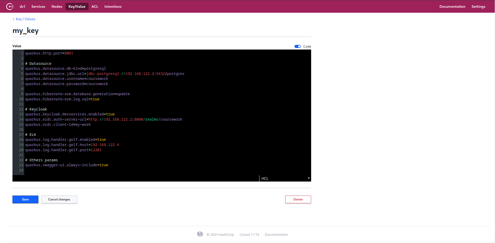

= Отчет по лабораторной работе No.6
:listing-caption: Листинг
:source-highlighter: coderay

Студенты: Перхуров В.А., Беляев А.Е.

Группа: ИВМ-22

== 1. Постановка задачи

В процессе выполнения лабораторной работы необходимо выполнить следующие задачи:

. Ознакомиться с инструментом Consul
. Организовать хранение пароля от БД в хешированном хранилище Consul
. Загрузить пароль от БД в приложение

== 2. Ход выполнения задачи

Так как серверная часть создана с применением фреймворка Quarcus, то целесообразно использовать решение, интегрированное в него для Работы с Consul, в частность, позволяющее получать всю конфигурацию (файл application.properties) приложения из хешированного хранилища. Для этого необходимо добавить зависимость в проект.

.Зависимость quarkus-config-consul
[source,xml]
----
<dependency>
    <groupId>io.quarkiverse.config</groupId>
    <artifactId>quarkus-config-consul</artifactId>
</dependency>
----

Сам файл application.properties, содержащийся в проекте в качестве содержимого должен содержать лишь указание на необходимость получения конфигурации из хешированного хранилища.

.Листинг файла application.properties
[source,hcl]
----
quarkus.consul-config.enabled=true  # конфигурацию необходимо получить из хранилища Консул
quarkus.consul-config.agent.host-port=192.168.122.6:8500  # адрес хранилища
quarkus.consul-config.properties-value-keys=my_key  # ключ !Путь нельзя! по которому наход. конфигурация
----

Важным моментом является то, что указывать необходимо именно ключ, а не путь, как указано в руководстве. Хранение в Consul всей конфигурации позволяет менять параметры не пересобирая само приложение, в частности можно легко изменить логин, пароль от базы данных, адреса серверов, к которым необходимо подключаться.

Далее необходимо развернуть само хранилище, сделать это целесообразно с использованием Docker-контейнера. 

.Файл конфигурации запуска контейнера
[source,xml]
----
version: '3.7'

networks:
    network:
        driver: bridge
        name: net_1

services:
    consul:
        image: consul:1.7
        hostname: consul
        ports:
            - "8500:8500"
            - "8501:8501"
        networks:
            - network
----

После этого необходимо создать в хранилище ключ, указанный в параметрах приложения и записать в качестве значения все параметры конфигурации приложения.

.Создание пары ключ-значение с конфигурацией приложения

== 3. Результаты выполнения

В результате выполнения задания было выполнено:

. Ознакомление с инструментом Consul
. Организация хранения пароля от БД в хешированном хранилище Consul
. Загрузка пароля от БД в приложение

== 4. Вывод

В результате выполнения лабораторной работы получены навыки по работе с хешированном хранилищем Consul.
